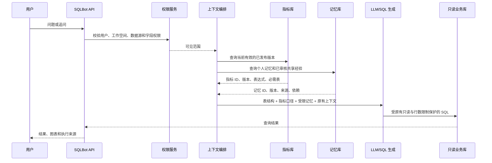
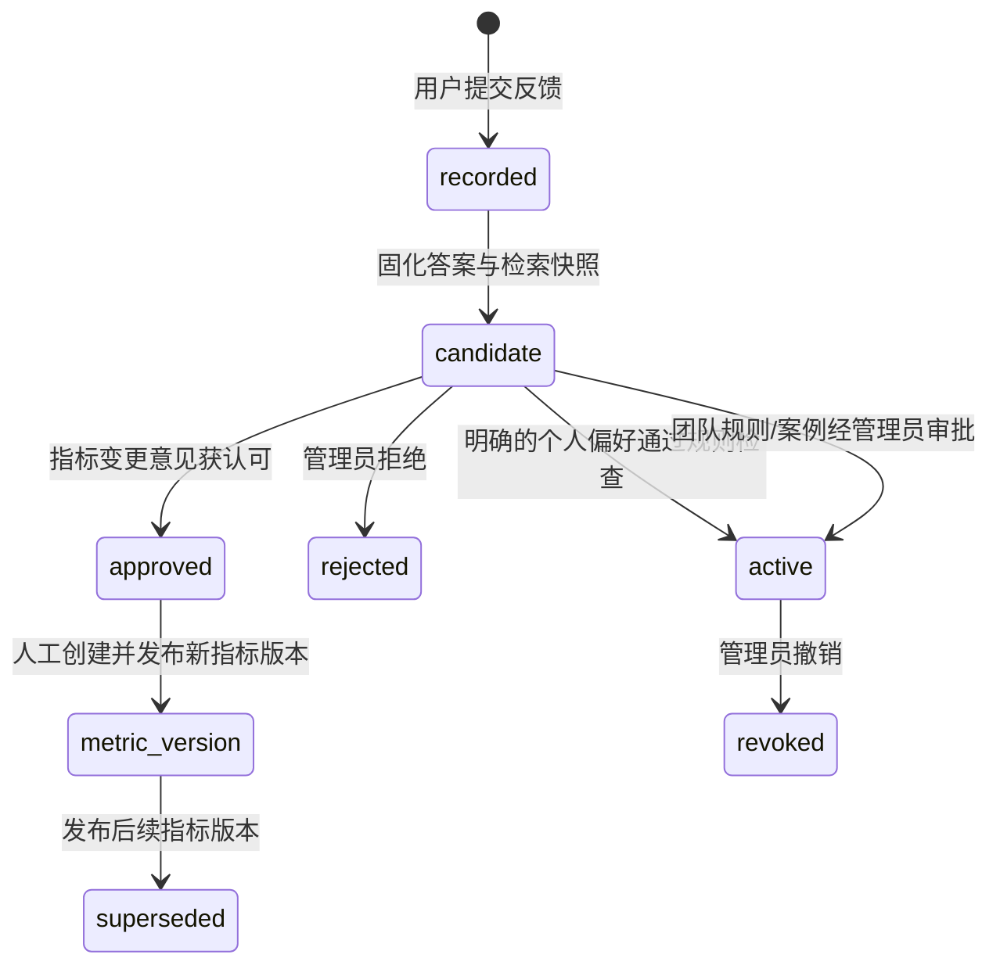

# 架构、数据流与“越用越聪明”的边界

## 在线回答路径

指标召回发生在语义选表之前，所以命中指标需要的表会加入选表约束。每次回答写入 `retrieval_trace`，保存实际命中的指标版本和记忆版本。短追问只有在保守规则识别为上下文延续时才读取 `chat_context_state`，并继续使用同一个指标版本，避免“那 7 月呢？”在后台静默切换口径。

## 反馈与学习路径

`feedback_event` 绑定具体 `chat_record`、SQL、数据源、指标版本、记忆版本和幂等键。`learning_candidate` 保存待审核建议；`learning_job` 为后续独立 worker 保留持久化任务、租约、尝试次数和错误字段。当前 MVP 在请求内完成确定性提取并立即把任务标记为成功，不调用第二次 LLM，也不会阻塞已有答案生成。

## 信任与优先级

1. 数据权限是硬边界。指标、记忆和历史案例都不能扩大用户可见的表或字段。
2. 用户在当前问题中明确给出的时间、维度和展示要求优先于历史个人偏好。
3. 已发布指标版本决定标准计算口径。个人偏好主要控制展示和常用筛选，不能静默覆盖标准公式。
4. 已审核的工作空间经验可以补充业务规则或参考 SQL；未经审核的候选不参与召回。
5. 原有术语、SQL 示例和表结构继续参与上下文，但最终仍受数据源与权限过滤。
6. 遇到无法确定的口径冲突应进入澄清或人工审核，而不是按“最后写入者获胜”处理。

## 数据模型

| 表 | 关键职责 |
|---|---|
| `metric_definition` | 指标稳定身份、别名、数据源、负责人和当前发布版本 |
| `metric_version` | 不可变的表达式、维度、时间字段、过滤、JOIN、有效期和审核信息 |
| `memory_entry` | 个人/工作空间作用域、类型、正文、依赖、来源、版本、状态和有效期 |
| `chat_context_state` | 会话内当前指标版本、过滤条件、时间范围和最后一条回答 |
| `retrieval_trace` | 每条答案实际使用的指标与记忆来源 |
| `feedback_event` | 用户反馈、幂等键以及提交时的答案快照 |
| `learning_candidate` | 候选类型、建议内容、校验结果、冲突、审批与激活对象 |
| `learning_job` | 可恢复后台任务所需的状态、租约、重试和错误信息 |

## 当前实现的自适应能力

- 用户明确点击“记住”并填写偏好后，该偏好通过敏感值和数据源检查即可在本人后续会话生效。
- “正确”“结果不对”“口径不对”和“保存案例”生成团队候选；没有管理员审批时不会影响答案。
- 经审批的纠错成为有来源、版本和依赖的共享业务规则；经审批的 SQL 案例还必须是单条只读查询。
- 指标纠错只会标记为需要新指标版本，系统不会自动改写已发布指标。
- 所有记忆可暂停、删除或过期；已激活学习候选可撤销，下一次检索立即重新鉴权。

## 后续增强点

当前指标模块以结构化版本和受控提示接入已有 Text-to-SQL 主链。下一阶段应增加 `metric_id + version + dimensions + filters + time_range` 查询计划，并在支持范围内由编译器生成指标片段，再对生成 SQL 做粒度、过滤、JOIN 和时间语义校验。

当前记忆排序使用关键词、标题、类型和优先级。在完整 embedding 模型可用后，可以在数据库作用域过滤内加入向量候选，并记录模型 ID、维度和重建批次。向量分数只能用于召回排序，不能替代权限检查或业务审核。

后台学习还需要独立 worker 执行租约领取、崩溃恢复、指数退避和死信处理。自动 schema 指纹、JOIN 变化检测、冲突图以及批量停用也属于试点前增强项。
