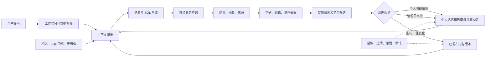

# SQLBot Adaptive 二创总览

本分支以 SQLBot `v1.10.1` 为固定基线，增加受治理的指标库、跨会话记忆和反馈学习闭环。开发环境已经在 Windows 上完成无 Docker 运行：Vue 与 FastAPI 运行在 Windows，PostgreSQL 17 与 pgvector 运行在 WSL2 Ubuntu。

当前可演示的完整闭环是：发布“净销售额 v1”指标 → 问数时命中精确版本和必需表 → 新会话召回个人偏好 → 对答案提交纠错 → 生成团队候选 → 管理员审批后成为共享经验 → 撤销后立即停止召回。回答执行详情会记录具体指标版本、记忆版本和追问继承来源。

## 全景图



这里的“越用越聪明”指可观测、可撤销的检索增强：系统从用户明确确认的偏好和经过审核的团队经验中学习。它不会根据一次查询成功或单次点赞自动修改标准指标，也不会在运行中自行训练模型权重。

## 当前页面

| 页面 | 作用 | 实机截图 |
|---|---|---|
| 指标库 | 创建指标、编辑草稿、发布不可变版本、查看版本历史 | [指标列表](metric-catalog-smoke.png)、[指标编辑](metric-editor-smoke.png) |
| 我的记忆 | 新建、编辑、暂停、启用和删除个人偏好 | [记忆管理](memory-catalog-smoke.png) |
| 学习中心 | 查看候选、审批、拒绝和撤销团队经验 | [学习中心](learning-center-smoke.png) |
| 智能问数 | 显示结果并提交正确、结果不对、口径不对、保存案例或记住偏好 | [反馈入口](feedback-controls-smoke.png) |

## 文档入口

- [实施状态与十步进度](IMPLEMENTATION_STATUS.md)
- [架构、数据流与信任边界](ARCHITECTURE.md)
- [无 Docker 开发与验证手册](DEVELOPMENT.md)
- [新增 API 与状态机](API.md)
- [上线、回滚、上游同步与许可边界](OPERATIONS.md)
- [评测工具说明](../../evaluations/README.md)

## 最快体验

准备好根目录 `.env` 和本地 PostgreSQL 后，在两个 PowerShell 终端运行：

```powershell
# 终端 A
Set-Location D:\python\SQLBot-adaptive
.\scripts\start-dev-backend.ps1
```

```powershell
# 终端 B
Set-Location D:\python\SQLBot-adaptive
.\scripts\start-dev-frontend.ps1
```

随后打开 `http://127.0.0.1:5173`。完整的首次安装、造数、迁移、测试和构建命令见 [开发手册](DEVELOPMENT.md)。
